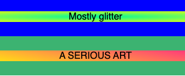

## Make some shapes

### Step 1
In the **HTML tab**, add shape the classes `square` and `rounded` inside both of the `
` tags.

--- code ---
---
language: html
filename: index.html
line_numbers: true
line_number_start: 9
line_highlights: 10, 14
---
  <section class="row row-one">
    
Mostly glitter

  </section>

  <section class="row row-two">
    
A SERIOUS ART

  </section>
--- /code ---

### Step 2

In the **CSS tab**, style the shapes:

- edit the colour of the gradients by changing the names
- experiment with the `border-radius` and `linear-gradient` values.

--- code ---
---
language: css
filename: style.css
line_numbers: true
line_number_start: 19
line_highlights: 19-26
---
.square {
  background: radial-gradient(MediumSpringGreen, yellow);
}

.rounded {
  background: linear-gradient(190deg, deeppink, yellow);
  border-radius: 999px;
}
--- /code ---

### Now run your code
Check that the words have colourful shape backgrounds.

