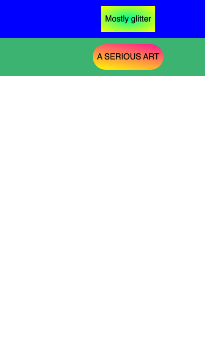

## Style all the shapes

Give the shapes the same basic spacing and alignment.

In the CSS file, near the top of the file, add one shared style for the shape classes.

--- code ---
---
language: css
filename: style.css
line_numbers: true
line_number_start: 28
line_highlights: 28-43
---
.rounded,
.banner,
.square,
.rectangle,
.circle {
  display: inline-flex;
  align-items: center;
  justify-content: center;
  box-sizing: border-box;
  margin: 4px 6px;
  padding: 8px;
  text-align: center;
  vertical-align: middle;
  min-height: 50px;
  min-width: 50px;
}
--- /code ---

### Now run your code
Run your code and check that the words sit in the middle of each shape. Play with values until you have the look you want.

