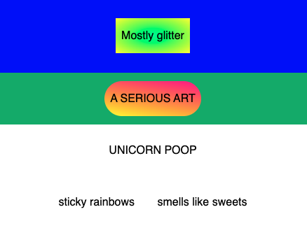

## Make more rows

In the **html tab** add more rows. Two more rows are shown here, replace the text with your own words.

--- code ---
---
language: html
filename: index.html
line_numbers: true
line_number_start: 17
line_highlights: 17-24
---
  <section class="row row-three">
    
UNICORN POOP

  </section>

  <section class="row row-four">
    
sticky rainbows

    
smells like sweets

  </section>
--- /code ---

### Now run your code
Check that the new rows appear under the first two rows. You can add as many rows as you like in the same way.

