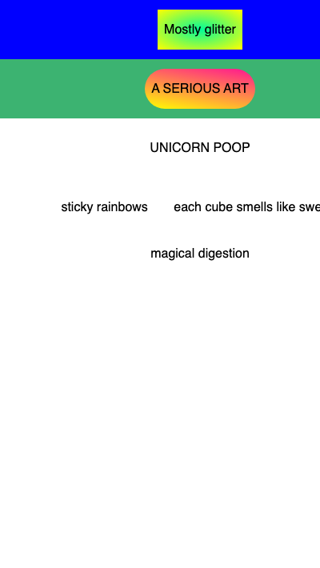

## Make more rows

Add more rows and experiment with different text and shapes in your code.

Two more rows are shown here, you can add as many rows as you like in the same way.

Add more rows in HTML. Include your text and shape names.

--- code ---
---
language: html
filename: index.html
line_numbers: true
line_number_start: 17
line_highlights: 17-25
---
  <section class="row row-three">
    
UNICORN POOP

  </section>

  <section class="row row-four">
    
sticky rainbows

    
each cube smells like sweets

    
magical digestion

  </section>
--- /code ---

### Now run your code
Run your code and check that the new rows appear under the first two rows.

