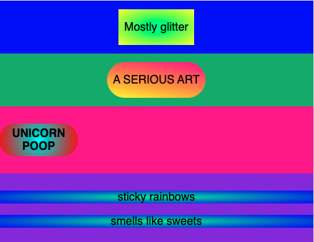

## Style the new rows

Then style the new rows and shapes in the **CSS tab**.

### Step 1
Change the background colours on each new row.

--- code ---
---
language: css
filename: style.css
line_numbers: true
line_number_start: 16
line_highlights: 19-25
---
  background: mediumseagreen;
} 

.row-three { 
  background: deeppink; 
}

.row-four { 
  background: blueviolet; 
}

.square {
--- /code ---

### Step 2
Experiment with new shapes.

--- code ---
---
language: css
filename: style.css
line_numbers: true
line_number_start: 33
line_highlights: 36-46
---
  border-radius: 999px;
}

.banner {
  background: radial-gradient(circle, aqua, red);
  border-radius: 22px;
  padding: 5px;
  width: 100px;
  font-weight: 700;
}

.rectangle {
  background: radial-gradient(MediumSpringGreen, blue);
}

.rounded,
.square {
--- /code ---

### Now run your code
Check that the new rows and shapes look how you want.

> ### Debugging
> 
> If a shape does not change, check that the class name in your HTML matches the CSS name exactly.
{: .c-project-callout .c-project-callout--debug}

