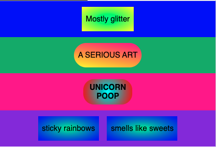

## Line up the shapes

Add the shape names to the shared CSS rules, so every shape uses the same instructions for lining up its text.

--- code ---
---
language: css
filename: style.css
line_numbers: true
line_number_start: 44
line_highlights: 49-52
---
.rectangle {
  background: radial-gradient(MediumSpringGreen, blue);
}

.rounded,
.square,
.banner,
.rectangle,
.circle {
  display: inline-flex;
  align-items: center;
  justify-content: center;
--- /code ---

### Now run your code
Check that the text sits in the middle of each shape.

