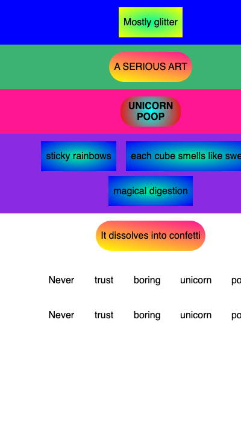

## Challenge: add a moving ticker text

Add new rows that will scroll like a news ticker.

Add a row for the confetti text and a row with two matching ticker sets.

--- code ---
---
language: html
filename: index.html
line_numbers: true
line_number_start: 27
line_highlights: 27-48
---
  <section class="row row-five">
    
It dissolves into confetti

  </section>

  <section class="row row-six">
    <section class="ticker">
      <section class="ticker-set">
        
Never

        
trust

        
boring

        
unicorn

        
poop

      </section>
      <section class="ticker-set">
        
Never

        
trust

        
boring

        
unicorn

        
poop

      </section>
    </section>
  </section>
--- /code ---

### Now run your code
Run your code and check that the ticker words appear in the final row.

