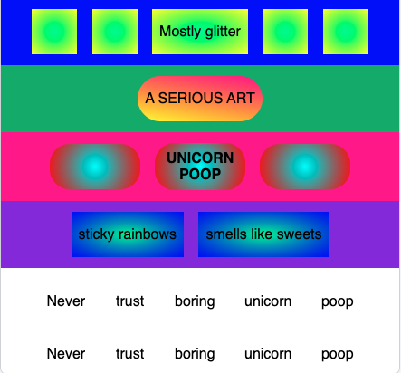

## Decorate with blank shapes

In the **HTML tab**, add blank shapes before and after your text shapes to make patterns.

--- code ---
---
language: html
filename: index.html
line_numbers: true
line_number_start: 9
line_highlights: 10-11, 13-14, 22, 24
---
 <section class="row row-one">
    

    

    
Mostly glitter

    

    

  </section>

  <section class="row row-two">
    
A SERIOUS ART

  </section>

  <section class="row row-three">
    

    
UNICORN POOP

    

  </section>
--- /code ---

### Now run your code
Check that the blank shapes make a pattern around your words. Experiment with mixing the shapes across the rows.

