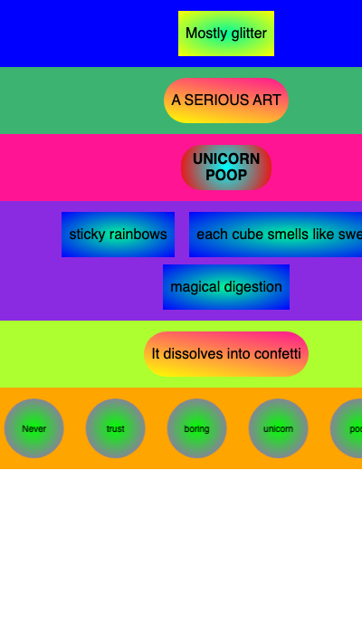

## Challenge: add a moving ticker style

Add the CSS to move the ticker text.

--- code ---
---
language: css
filename: style.css
line_numbers: true
line_number_start: 65
line_highlights: 65-106
---
.row-five {
  background: greenyellow;
}

.row-six {
  background: orange;
}

.circle {
  width: 66px;
  height: 66px;
  background: radial-gradient(circle, lime, mediumorchid);
  border-radius: 50%;
  font-size: 10px;
}

.row-six {
  overflow: hidden;
}

.ticker {
  display: flex;
  width: max-content;
  animation: ticker 12s linear infinite;
}

.ticker-set {
  display: inline-flex;
  gap: 12px;
  min-width: 100vw;
  flex-shrink: 0;
}

@keyframes ticker {
  from {
    transform: translateX(0);
  }

  to {
    transform: translateX(-50%);
  }
}
--- /code ---

### Now run your code
Check that the final row scrolls across the screen again and again.

