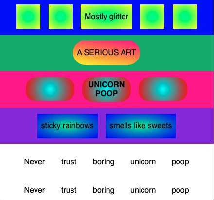

## Challenge: add moving ticker text

As a challenge, animate your site with a news ticker.

First in the **html tab** add a new row, with two sets of ticker text.

--- code ---
---
language: html
filename: index.html
line_numbers: true
line_number_start: 29
line_highlights: 29-49
---
    
smells like sweets

  </section>

  <section class="row row-five">
    <section class="ticker">
      <section class="ticker-set">
        
Never

        
trust

        
boring

        
unicorn

        
poop

      </section>
      <section class="ticker-set">
        
Never

        
trust

        
boring

        
unicorn

        
poop

      </section>
    </section>
  </section>

</body>
--- /code ---

### Now run your code
Run your code and check that the ticker words appear.

> ### Tip
> 
> You need two ticker sets so there is no blank space when the words move.
{: .c-project-callout .c-project-callout--tip}
